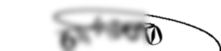
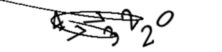
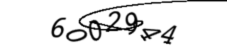

# Animated captcha generator
[🇷🇺 Русский](README.md) • [🇬🇧 English](README_EN.md)

<div align="center">

# 🔢 Captcha Generator Studio

**Python • Pillow • NumPy • SciPy**

Гибкий и мощный генератор капч для генерации статичных (PNG) и анимированных (GIF) изображений. Создает сложные, устойчивые к OCR капчи с использованием математических искажений, кривых Безье и динамического размытия.

<br>

[](https://www.python.org/)
[](https://python-pillow.org/)
[](https://numpy.org/)
[](https://scipy.org/)
[](LICENSE)

</div>

---

## 🎬 Как это выглядит

<p align="center">
  
  <br>
  <em>Пример анимированной капчи (цифры подпрыгивают, полоса размытия скользит)</em>
</p>

---

## ✨ Возможности

- 📦 **Два формата:** Генерация статичных изображений (`.png`) и анимаций (`.gif`).
- 🎨 **13 встроенных шрифтов:** Papyrus, Book Antiqua, Mistral, Captcha Code, Courier New (включая bold/italic), LED Dot Matrix, Lucida Handwriting, Tahoma и др.
- 🌀 **Математические искажения:**
  - Случайные кривые Безье на фоне (на основе полиномов Бернштейна).
  - Синусоидальная траектория расположения текста.
  - Случайный поворот каждого символа (до 60 градусов).
- 🎞️ **Анимация (GIF):**
  - Эффект "подпрыгивания" цифр с случайной фазой и амплитудой.
  - Бесшовная движущаяся полоса гауссова размытия (blur strip).
- 🛠️ **Полная кастомизация:** Все параметры (размер, цвет, количество точек кривой, амплитуда размытия и т.д.) вынесены в начало скрипта.

---

## 📸 Скриншоты

| 🖼️ Статичная капча (PNG) | 🎞️ Кадр из анимации (GIF) |
|:---:|:---:|
|  |  |

---

## 🚀 Установка и запуск

### Требования
- Python 3.10+
- Библиотеки: `Pillow`, `NumPy`, `SciPy`

### Шаги

1. Клонируйте репозиторий:
```bash
git clone https://github.com/ВАШ_НИК/captcha_generator_studio.git
cd captcha_generator_studio
```

2. Создайте и активируйте виртуальное окружение (опционально, но рекомендуется):
```bash
python -m venv .venv
# Windows:
.venv\Scripts\activate
# Linux / macOS:
# source .venv/bin/activate
```

3. Установите зависимости:
```bash
pip install pillow numpy scipy
```

4. Запустите скрипт:
```bash
python captcha_generator.py
```

5. Следуйте инструкциям в консоли:
```text
Формат капчи (png / gif): gif
Сколько каптч сгенерировать: 5
```
Сгенерированные файлы будут сохранены в папку `captchas/`.

---

## ⚙️ Настройка

Все основные параметры находятся в блоке `ПАРАМЕТРЫ ДЛЯ НАСТРОЙКИ` в файле `captcha_generator.py`. Вы можете легко изменить:

- `IMAGE_WIDTH`, `IMAGE_HEIGHT`: Размер итогового изображения.
- `MAX_ROTATION_ANGLE`: Максимальный угол наклона цифр.
- `FONT_SIZE`: Размер шрифта.
- `GIF_FRAMES`, `GIF_FRAME_DURATION`: Количество кадров и скорость проигрывания GIF.
- `BLUR_RECT_DIRECTION`: Направление движения полосы размытия (`1` — вправо, `-1` — влево).

> ⚠️ **Внимание:** Для работы скрипта необходимо, чтобы файлы шрифтов (`.ttf`, `.otf`) находились в той же папке, что и сам скрипт.

## 📄 Лицензия

Проект распространяется под лицензией [MIT](LICENSE).

---

<div align="center">

### Если проект оказался полезным — поставь ⭐

</div>

